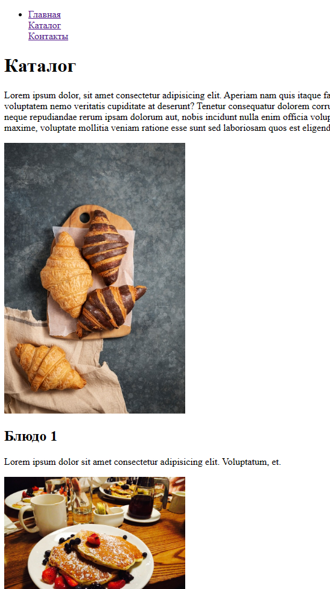

# Веб-вёрстка HTML/CSS (семинары) Урок 1. Введение и Основы HTML
## Простой Веб-сайт на HTML

Пример простого веб-сайта, состоящего из главной страницы и страницы каталога. Идеально подходит для новичков, изучающих основы веб-разработки.

## Структура проекта

- `index.html`: Главная страница сайта с основной информацией и ссылками на другие разделы.
- `catalog/`: Папка, содержащая файлы каталога.
  - `catalog.html`: Страница каталога с изображениями и описанием товаров.
- `img/`: Папка для изображений товаров, используемых на сайте.

## Вид получившейся страницы

